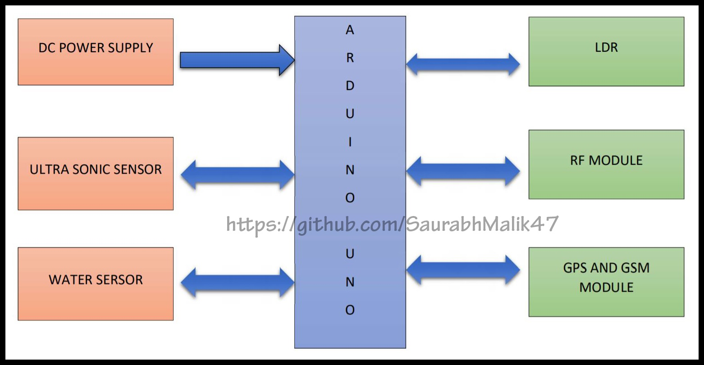
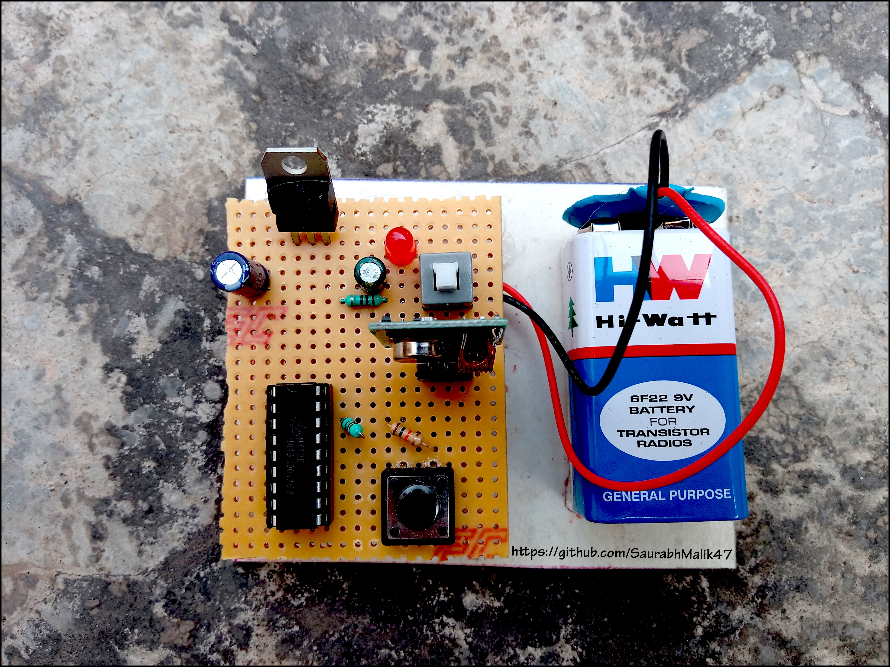

# Arduino Based Smart Walking Cane (Saurabh Malik)

_This is Arduino Based Smart Walking Cane for Visually Impaired People with following 5 Functions:_
1) Obstacle Detection
2) Water Detection
3) Darkness Detection
4) Finding Cane
5) Emergency Button

**Block Diagram**

**Smart Walking Cane**

**Remote**
